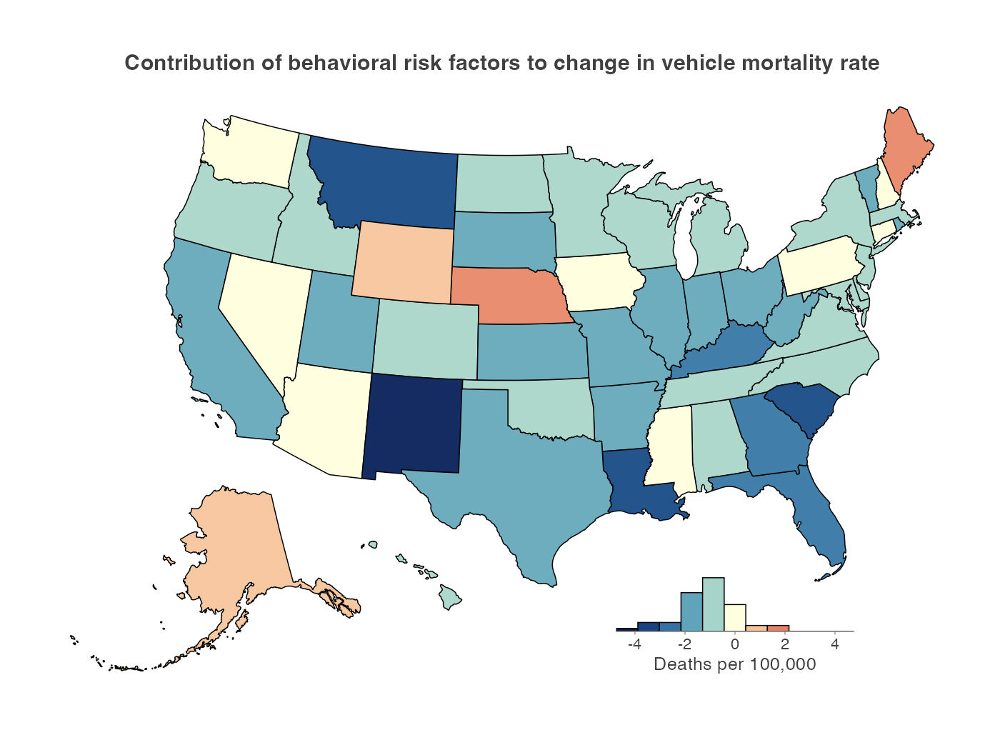

## Factors Associated With Postpandemic Decline in US Motor Vehicle Mortality



This repository, [`traffic_deaths`](https://github.com/mkiang/traffic_deaths), contains reproducible code and data for our research letter, "[Factors Associated With Postpandemic Decline in US Motor Vehicle Mortality](https://doi.org/10.1001/jamanetworkopen.2026.38041)". We use the Kitagawa decomposition on publicly available crash, exposure, and population data to decompose the 2021-2024 decline in US motor vehicle mortality into a vehicle-miles-traveled (VMT) exposure component and a per-mile risk component. We further partition the per-mile risk effect into 11 mutually exclusive behavioral and road-user categories.

The full citation is:

> Kiang MV, Alexander MJ. Factors Associated With Postpandemic Decline in US Motor Vehicle Mortality. *JAMA Network Open*. 2026;9(10):e2638041 doi:[10.1001/jamanetworkopen.2026.38041](https://doi.org/10.1001/jamanetworkopen.2026.38041)

This research letter is open access. Both the [publisher's PDF](https://github.com/mkiang/traffic_deaths/blob/main/manuscript/kiang_alexander_traffic.pdf) and the author's accepted manuscript (AAM) are available in [`./manuscript`](./manuscript). Please cite the publisher's version. 

## Issues

Please report issues via email or the [issues page](https://github.com/mkiang/traffic_deaths/issues).

## About this repository

All code can be found in the `./code` folder and is designed to be run sequentially. The first few lines of each code file contain a brief description of the tasks related to that file.

- **`./code`**: Contains all analytic code.
    - Scripts `01` through `05` ingest crash, exposure, mortality, and population data and build the analytic panel.
    - Scripts `06` through `10` compute dispersion parameters, perform the Kitagawa decomposition and behavioral partition, and run the primary Monte Carlo simulation.
    - Scripts `11` through `15` generate figures (including figures not in the manuscript).
    - Scripts in the `30`s and `40`s ranges are additional analyses (weather, road type).
    - Scripts in the `50`s, `60`s, `70`s, `80`s, and `90`s are sensitivity analyses.
    - The `utils.R` file contains shared utility functions and `mk_nytimes.R` contains the custom ggplot2 theme.
- **`config.yml`**: Project-wide parameters (study years, random seed, number of simulation batches and iterations, maximum cores).
- **`./data`**: Contains processed, analysis-ready data files (parquet format) read by downstream code, including the state-year analytic panel and the simulation summaries.
- **`./data_raw`**: Contains all (publicly available) raw data necessary to run the analysis. See [`./data_raw/README.md`](./data_raw/README.md) for sources, query URLs, and access dates.
- **`./output`**: Contains CSV representations of the figures and tables (plotted/tabulated data only).
- **`./plots`**: Contains all manuscript figures in PDF (vector) and JPG formats.
- **`./qmd`**: Contains Quarto documents that generate Table 1 and the supplemental eTables.
- **`./manuscript`**: Contains manuscript PDFs (both publisher's and author's accepted versions), the supplemental manuscripts, and the `qmd` files that generated them. 
- **`./temp_output`**: Contains the Monte Carlo simulation files. This folder is large and **not included on GitHub**. Interested researchers can email the corresponding author to get the raw simulation files, but these files can be generated in the code.

### `./qmd` folder

Each table is its own Quarto document and can be rendered with `quarto render` from the `./qmd` folder.

- **`01_table1.qmd`**: Table 1 — national Kitagawa decomposition. ([HTML preview](https://htmlpreview.github.io/?https://github.com/mkiang/traffic_deaths/blob/main/qmd/01_table1.html))
- **`etable01_bin_rates.qmd`**: eTable 1 — category-level deaths and per-capita rates, 2021 and 2024. ([HTML preview](https://htmlpreview.github.io/?https://github.com/mkiang/traffic_deaths/blob/main/qmd/etable01_bin_rates.html))
- **`etable01_interactive.qmd`**: Interactive per-state version of eTable 1 (self-contained HTML; select any state). ([HTML preview](https://htmlpreview.github.io/?https://github.com/mkiang/traffic_deaths/blob/main/qmd/etable01_interactive.html))
- **`etable02_sensitivity.qmd`**: eTable 2 — sensitivity of the uncertainty intervals to the dispersion model. ([HTML preview](https://htmlpreview.github.io/?https://github.com/mkiang/traffic_deaths/blob/main/qmd/etable02_sensitivity.html))
- **`etable03_road_type.qmd`**: eTable 3 — road-type distribution of deaths and stratified decomposition (urban vs rural). ([HTML preview](https://htmlpreview.github.io/?https://github.com/mkiang/traffic_deaths/blob/main/qmd/etable03_road_type.html))
- **`etable04_weather.qmd`**: eTable 4 — weather distribution of deaths and partition of the per-mile risk effect. ([HTML preview](https://htmlpreview.github.io/?https://github.com/mkiang/traffic_deaths/blob/main/qmd/etable04_weather.html))

## Authors

- [Mathew V Kiang](https://mathewkiang.com) (: [mkiang](https://github.com/mkiang))
- [Monica J Alexander](https://monicaalexander.com) (: [mjalexander](https://github.com/mjalexander))

## Acknowledgements

Anthropic's Claude Opus 4.8 was used to lint and document the reproducible code but not for code creation. Specifically, Claude was used to:

- Consolidate/remove redundant code into the `utils.R` file
- Add `{roxygen}` documentation to functions.
- Improve supplemental `README` files (in `./data`, `./data_raw`, `./code`, and other places but not **this** `README`)
- Reformat code into a consistent style across files.
- Other miscellaneous, non-coding operations (e.g., renaming files, adding a `LICENSE`, verifying the pipeline is fully reproducible in a different environment)

## Notes on reproducibility

### Data availability

All data used in this project are publicly available; no restricted-access data are required. The raw files (with query URLs and access dates) are documented in [`./data_raw/README.md`](./data_raw/README.md):

- **Crash fatalities**: [FARS National Annual Report files](https://www.nhtsa.gov/research-data/fatality-analysis-reporting-system-fars) (NHTSA), 2018-2024.
- **Exposure (VMT)**: [FHWA Highway Statistics Table VM-2](https://www.fhwa.dot.gov/policyinformation/statistics.cfm), 2018-2024.
- **Mortality and population**: [CDC WONDER](https://wonder.cdc.gov/) Multiple Cause of Death and Single-Race population estimates.

### Computational requirements

Computational requirements for this project are minimal. All analyses can be run on a typical modern laptop in a trivial amount of time.

### Package management

This project uses the [`{tidyverse}`](https://www.tidyverse.org/) packages and:

- [`{arrow}`](https://arrow.apache.org/docs/r/) and [`{duckdb}`](https://r.duckdb.org/) to query simulations,
- [`{foreach}`](https://cran.r-project.org/package=foreach), [`{doParallel}`](https://cran.r-project.org/package=doParallel), and [`{doRNG}`](https://cran.r-project.org/package=doRNG) for reproducible parallelized simulation,
- [`{config}`](https://cran.r-project.org/package=config), [`{fs}`](https://cran.r-project.org/package=fs), and [`{here}`](https://here.r-lib.org/) for project management,
- [`{gt}`](https://gt.rstudio.com/), and [`{reactable}`](https://glin.github.io/reactable/) for making tables.

Run `renv::restore()` to get the correct package versions.

### Session info

```r
> sessioninfo::session_info()
─ Session info ───────────────────────────────────────────────────────────────
 setting  value
 version  R version 4.5.2 (2025-10-31)
 os       macOS Tahoe 26.5.2
 system   aarch64, darwin20
 ui       X11
 language (EN)
 collate  en_US.UTF-8
 ctype    en_US.UTF-8
 tz       America/Los_Angeles
 date     2026-07-17
 pandoc   3.10 @ /opt/homebrew/bin/pandoc
 quarto   1.9.37 @ /usr/local/bin/quarto

─ Packages ───────────────────────────────────────────────────────────────────
 ! package       * version   date (UTC) lib source
 P arrow         * 20.0.0.2  2025-05-26 [?] CRAN (R 4.5.0)
 P assertthat      0.2.1     2019-03-21 [?] CRAN (R 4.5.0)
 P BiocManager     1.30.27   2025-11-14 [?] CRAN (R 4.5.2)
 P bit             4.6.0     2025-03-06 [?] CRAN (R 4.5.0)
 P bit64           4.6.0-1   2025-01-16 [?] CRAN (R 4.5.0)
 P cellranger      1.1.0     2016-07-27 [?] CRAN (R 4.5.0)
 P class           7.3-23    2025-01-01 [?] CRAN (R 4.5.0)
 P classInt        0.4-11    2025-01-08 [?] CRAN (R 4.5.0)
 P cli             3.6.6     2026-04-09 [?] CRAN (R 4.5.2)
 P codetools       0.2-20    2024-03-31 [?] CRAN (R 4.5.0)
 P DBI           * 1.2.3     2024-06-02 [?] CRAN (R 4.5.0)
 P digest          0.6.39    2025-11-19 [?] RSPM (R 4.5.0)
 P doParallel    * 1.0.17    2022-02-07 [?] CRAN (R 4.5.0)
 P doRNG         * 1.8.6.3   2026-02-05 [?] CRAN (R 4.5.2)
 P dplyr         * 1.1.4     2023-11-17 [?] CRAN (R 4.5.0)
 P duckdb        * 1.3.1     2025-06-23 [?] CRAN (R 4.5.0)
 P e1071           1.7-16    2024-09-16 [?] CRAN (R 4.5.0)
 P edgeR         * 4.8.2     2025-12-23 [?] repository (https://github.com/bioc/edgeR@af0343a)
 P evaluate        1.0.3     2025-01-10 [?] CRAN (R 4.5.0)
 P farver          2.1.2     2024-05-13 [?] CRAN (R 4.5.0)
 P fastmap         1.2.0     2024-05-15 [?] CRAN (R 4.5.0)
 P forcats       * 1.0.0     2023-01-29 [?] CRAN (R 4.5.0)
 P foreach       * 1.5.2     2022-02-02 [?] CRAN (R 4.5.0)
 P fs            * 2.1.0     2026-04-18 [?] CRAN (R 4.5.2)
 P generics        0.1.4     2025-05-09 [?] CRAN (R 4.5.0)
 P geofacet      * 0.2.4     2025-06-28 [?] CRAN (R 4.5.0)
 P geogrid         0.1.2     2023-08-19 [?] CRAN (R 4.5.0)
 P ggplot2       * 3.5.2     2025-04-09 [?] CRAN (R 4.5.0)
 P ggrepel         0.9.6     2024-09-07 [?] CRAN (R 4.5.0)
 P ggsci         * 3.2.0     2024-06-18 [?] CRAN (R 4.5.0)
 P glue            1.8.1     2026-04-17 [?] CRAN (R 4.5.2)
 P gridExtra       2.3       2017-09-09 [?] CRAN (R 4.5.0)
 P gt            * 1.3.0     2026-01-22 [?] CRAN (R 4.5.2)
 P gtable          0.3.6     2024-10-25 [?] CRAN (R 4.5.0)
 P here          * 1.0.1     2020-12-13 [?] CRAN (R 4.5.0)
 P hms             1.1.3     2023-03-21 [?] CRAN (R 4.5.0)
 P htmltools     * 0.5.9     2025-12-04 [?] RSPM (R 4.5.0)
 P htmlwidgets     1.6.4     2023-12-06 [?] CRAN (R 4.5.0)
 P httr            1.4.7     2023-08-15 [?] CRAN (R 4.5.0)
 P httr2           1.1.2     2025-03-26 [?] CRAN (R 4.5.0)
 P iterators     * 1.0.14    2022-02-05 [?] CRAN (R 4.5.0)
 P jsonlite        2.0.0     2025-03-27 [?] CRAN (R 4.5.0)
 P KernSmooth      2.23-26   2025-01-01 [?] CRAN (R 4.5.0)
 P knitr         * 1.50      2025-03-16 [?] CRAN (R 4.5.0)
 P lattice         0.22-7    2025-04-02 [?] CRAN (R 4.5.2)
 P lifecycle       1.0.5     2026-01-08 [?] RSPM (R 4.5.0)
 P limma         * 3.66.0    2025-10-29 [?] repository (https://github.com/bioc/limma@1c4b971)
 P locfit          1.5-9.12  2025-03-05 [?] CRAN (R 4.5.0)
 P lubridate     * 1.9.4     2024-12-08 [?] CRAN (R 4.5.0)
 P magrittr        2.0.5     2026-04-04 [?] CRAN (R 4.5.2)
 P patchwork     * 1.3.0     2024-09-16 [?] CRAN (R 4.5.0)
 P pillar          1.10.2    2025-04-05 [?] CRAN (R 4.5.0)
 P pkgconfig       2.0.3     2019-09-22 [?] CRAN (R 4.5.0)
 P proxy           0.4-27    2022-06-09 [?] CRAN (R 4.5.0)
 P purrr         * 1.0.4     2025-02-05 [?] CRAN (R 4.5.0)
 P R6              2.6.1     2025-02-15 [?] CRAN (R 4.5.0)
 P rappdirs        0.3.4     2026-01-17 [?] RSPM (R 4.5.0)
 P RColorBrewer  * 1.1-3     2022-04-03 [?] CRAN (R 4.5.0)
 P Rcpp            1.1.1-1.1 2026-04-24 [?] CRAN (R 4.5.2)
 P reactable     * 0.4.5     2025-12-01 [?] CRAN (R 4.5.2)
 P readr         * 2.1.5     2024-01-10 [?] CRAN (R 4.5.0)
 P readxl        * 1.4.5     2025-03-07 [?] CRAN (R 4.5.0)
   renv            1.2.3     2026-05-16 [1] CRAN (R 4.5.2)
 P rlang           1.2.0     2026-04-06 [?] CRAN (R 4.5.2)
 P rnaturalearth   1.0.1     2023-12-15 [?] CRAN (R 4.5.0)
 P rngtools      * 1.5.2     2021-09-20 [?] CRAN (R 4.5.0)
 P rprojroot       2.0.4     2023-11-05 [?] CRAN (R 4.5.0)
 P scales          1.4.0     2025-04-24 [?] CRAN (R 4.5.0)
   sessioninfo   * 1.2.3     2025-02-05 [3] CRAN (R 4.5.0)
 P sf              1.0-21    2025-05-15 [?] CRAN (R 4.5.0)
 P sp              2.2-0     2025-02-01 [?] CRAN (R 4.5.0)
 P statmod         1.5.2     2026-05-17 [?] CRAN (R 4.5.2)
 P stringi         1.8.7     2025-03-27 [?] CRAN (R 4.5.0)
 P stringr       * 1.6.0     2025-11-04 [?] RSPM (R 4.5.0)
 P terra           1.8-54    2025-06-01 [?] CRAN (R 4.5.0)
 P tibble        * 3.2.1     2023-03-20 [?] CRAN (R 4.5.0)
 P tidyr         * 1.3.1     2024-01-24 [?] CRAN (R 4.5.0)
 P tidyselect      1.2.1     2024-03-11 [?] CRAN (R 4.5.0)
 P tidyverse     * 2.0.0     2023-02-22 [?] CRAN (R 4.5.0)
 P timechange      0.3.0     2024-01-18 [?] CRAN (R 4.5.0)
 P tzdb            0.5.0     2025-03-15 [?] CRAN (R 4.5.0)
 P units           0.8-7     2025-03-11 [?] CRAN (R 4.5.0)
 P usmap         * 0.7.1     2024-03-21 [?] CRAN (R 4.5.0)
 P vctrs           0.7.3     2026-04-11 [?] CRAN (R 4.5.2)
 P withr           3.0.2     2024-10-28 [?] CRAN (R 4.5.0)
 P xfun            0.52      2025-04-02 [?] CRAN (R 4.5.0)
 P xml2            1.3.8     2025-03-14 [?] CRAN (R 4.5.0)
 P yaml            2.3.10    2024-07-26 [?] CRAN (R 4.5.0)

 * ── Packages attached to the search path.
 P ── Loaded and on-disk path mismatch.

──────────────────────────────────────────────────────────────────────────────
```
